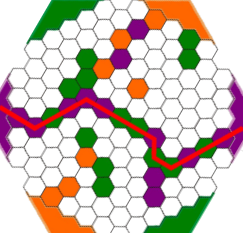
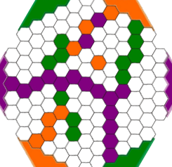
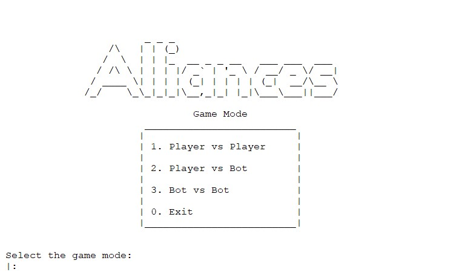
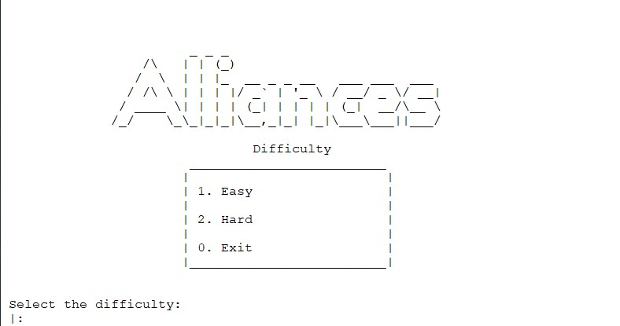
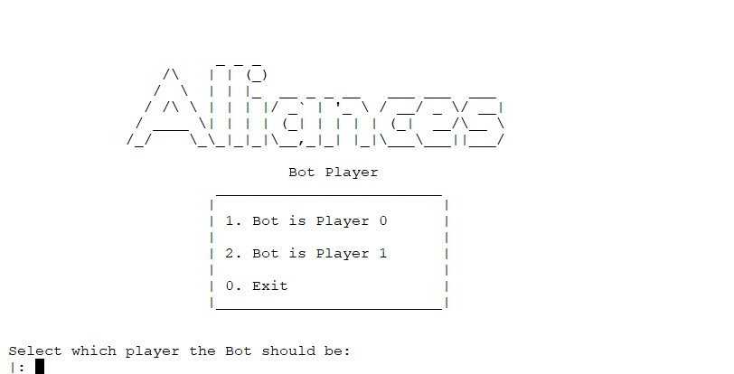
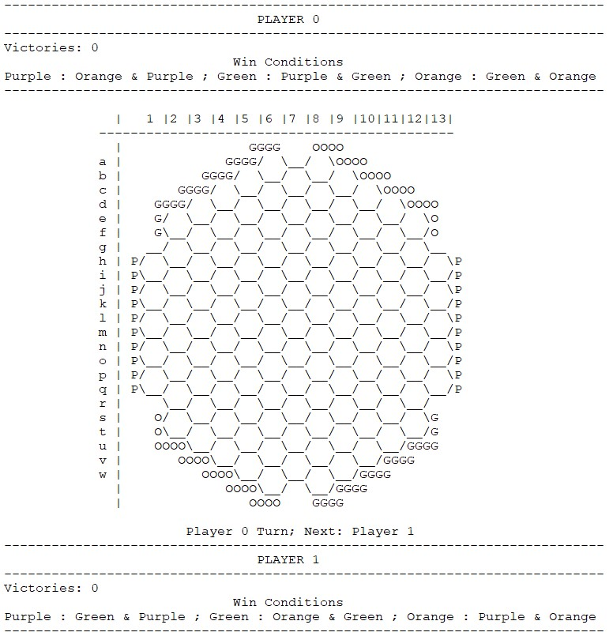
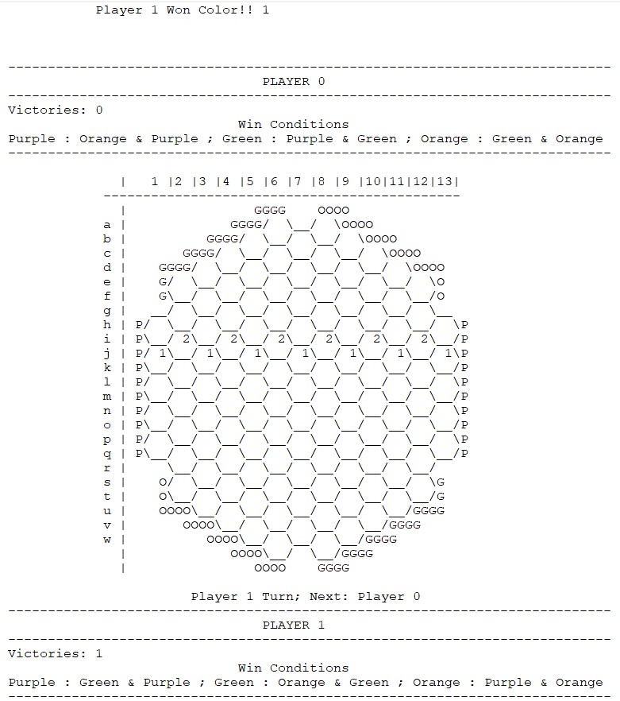
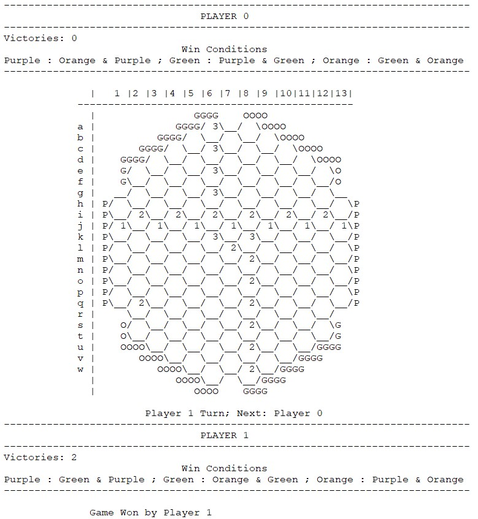

# Trabalho Prático Nº1 - Alliances

## Identificação

**Grupo T6_Alliances2**

- Beatriz Costa Silva Mendes - up201806551@fe.up.pt
- Hugo Miguel Monteiro Guimarães - up201806490@fe.up.pt

## Instalação e Execução

Para executar o jogo corretamente, é necessário cumprir os seguintes passos:

- Abrir o SicStus
- Executar a funcionalidade File -> Consult
    - Selecionar o ficheiro que se encontra em /src/main.pl
- Executar o predicado ***play.***

## O Jogo - Alliances

### Componentes

- 1 tabuleiro
- 42 discos verdes
- 42 discos laranja
- 42 discos roxos
- 2 discos de prata

### Regras

Cada jogador tem as suas ***allied colours***. Estas são usadas para conectar os dois lados do tabuleiro e diferem entre jogadores. Posteriormente está uma tabela com a distinção das *allied colours* para cada jogador.

|Para conectar   |Laranja  |Roxo   |Verde   |
|---|---|---|---|
|**Jogador 1**   |Laranja + Roxo   |Roxo + Verde   |Verde + Laranja   |
|**Jogador 2**   |Laranja + Verde   |Roxo + Laranja   |Verde + Roxo   |

### Gameplay

- Em cada turno, um jogador necessita de colocar um disco de uma cor à sua escolha num espaço vazio.
- Se uma conexão é feita entre lados opostos da mesma cor, utilizando os discos das cores aliadas, esse jogador ganha essa cor.
- Cada cor pode apenas ser ganha por 1 jogador.
- O jogo termina quando um dos jogadores ganha a sua segunda cor, sendo atribuida a vitória a esse mesmo jogador.
- Se uma jogada bloquear qualquer jogada subsequente que permita um jogador ganhar uma cor, o oponente do jogador bloqueado ganha essa cor.
- No caso de um jogada formar uma conexão para ambos os jogadores, a cor e atribuida ao jogador que colocou o disco.



*Exemplo 1: Jogador 2 venceu ao unir a cor roxa usando peças verdes e roxas*



*Exemplo 2: Jogador 2 venceu ao impedir usando uma barreira roxa o jogador 1 de conectar a cor laranja.*

## Lógica do Jogo
### Representação interna do estado de jogo

- **Tabuleiro** - É representado através de uma lista de listas de uma malha hexagonal, contendo os seguintes átomos. Cada um destes átomos, no início do jogo, tem como nome a sua coordenada. No decorrer do jogo, quando uma coordenada passa a ter uma cor, este átomo passa a ser representado com 1 (roxo), 2 (verde) ou 3 (laranja). 
- **Vitórias** - a primeira lista desta lista de listas pela qual é representado o estado de jogo corresponde às cores ganhas por cada jogador: 0, foi ganho pelo jogador 0; 1, foi ganho pelo jogador 1; 2, não foi ganha ainda por nenhum jogador.
- **Jogador** - representado através do argumento ````Player```` na maior parte das funções. No decorrer do jogo, é apresentado a quem pertence o turno atual e de quem será o turno seguinte.

### Visualização do estado de jogo

Inicialmente, são apresentados vários menus que permitem que o utilizador selecione se pretende jogador contra outro jogador, se pretende jogar contra o Computador ou se pretende ver um jogo de Computador contra Computador, bem como as dificuldade do Computador e ainda qual jogador o Computador deve ser.


*Imagem 1: Menu para escolher o modo de jogo pretendido*


*Imagem 2: Menu para escolher a dificuldade do Computador*


*Imagem 3: Menu para escolher qual jogador o Computador deve ser*

Quando começa o jogo, é imprimido um ecrã um conjunto de dois *headers* e o tabuleiro principal. Estes *headers* possuem informação sobre cada jogador, sendo esta constituída pelo número de cores que ganhou até ao momento e as suas condições de vitória. Em relação ao tabuleiro de jogo, este é constituído por coordenadas verticais (de "a" a "w") e horizontais (de 1 a 13) e por um tabuleiro com casas hexagonais. Este tabuleiro é obtido a partir de um conjunto de ````format````' e ````write````'s.


*Imagem 4: Tabuleiro exemplo*

Quando uma cor é ganha, apresentada uma mensagem que informa os jogadores de qual cor foi ganha e qual jogador a ganhou.


*Imagem 5: Exemplo da vitória de uma cor (jogador 1 ganhou a cor "purp)*

Quando o jogo termina, ou seja, quando um jogador consegue ganhar duas cores, é apresentada uma mensagem a dizer que esse mesmo jogador conseguiu terminar o jogo.


*Imagem 6: Exemplo da vitória do Jogador 1*

### Lista de Jogadas Válidas

````prolog
valid_moves(+GameState, +Player, -ListOfMoves)
````
Com o objetivo de se obter uma lista com todas as jogadas possíveis no tabuleiro atual, criamos o predicado ````valid_moves````. Este achata a lista de listas correspondente ao ````GameState```` passado como argumento, remove todos os números presentes (uma vez que os números correspondem a posições já jogadas) e retorna a lista obtida com todas as jogadas possíveis em ````ListOfMoves````. Note-se que no caso do nosso jogo, o argumento ````Player```` acaba por não ter utilidade uma vez que cada jogador pode jogar em qualquer local do tabuleiro desde que esta posição não tenha sido jogada anteriormente.

### Execução de Jogadas
````prolog
move(+GameState,+Move,-NewGameState)​
````
De modo a executar uma jogada, é primeiro necessário validar o input do utilizador. Tal é feito utilizado o predicado ````valid_move````, que verifica se a jogada recebida faz parte da lista ````valid_moves```` mencionada anteriormente.

Após o sucesso da validação, é chamado o predicado ````move```, que altera a lista de listas ````GameState```` de acordo com a jogada recebida.

Para além disso, é necesário atualizar os factos dos predicados ````color/2```` e ````connected/2````, os quais são essenciais para a verificação de condições de vitória

### Final do Jogo

````prolog
game_over(+GameState, -Winner)
````

Para se terminar o *loop* principal do nosso jogo, foi criado o predicado ````game_over````. O jogo *Alliances* termina quando um dos jogadores obtiver duas cores, logo neste predicado é feito um *count* de cores ganhas por cada jogador. Esta informação encontra-se na primeira lista presente na lista do ````GameState````. Se algum destes tiver um valor igual a 2, este jogador será retornado em ````Winner```` e será terminado o loop principal do jogo. 

````prolog
check_win(+Player,+InitialGamestate,-FinalGamestate)
````
É também relevante explicar o uso do predicado ````check_win````, dado que, tal como o nome indica, está integralmente associado à condição de vitória.

Este predicado interpreta ````InitialGameState```` como um grafo e realiza uma pesquisa em profundidade em busca das condições de vitória, ou seja, de ligações diretas entre dois extremos do tabuleiro com a mesma cor.

### Avaliação do Tabuleiro

````prolog
​value(+GameState, +Player, -Value)
````
Este predicado calcula o ````Value```` de um ````GameState```` para um ````Player````, tendo em conta o número de vitórias do ````Player```` e as jogadas realizadas de acordo com as restantes cores que necessita para ganhar. Quando o tabuleiro está num estado inicial de jogo, o valor das diferentes jogadas disponíveis é semelhante, dado que não é claro qual jogador se encontra em vantagem.

Porém, à medida que o jogo avança e o ````GameState```` se encontra num estado mais avançado, este predicado retorna ````Values```` cada vez mais precisos, os quais permitem calcular qual jogador se encontra numa situação mais vantajosa.

### Jogada do Computador

````prolog
choose_move(+GameState, +Player, +Level, -Move)
````
Este predicado calcula a jogada a ser feita conforme a dificuldade escolhida.

Na dificuldade ````Easy```` a jogada é gerada aleatóriamente, sendo a posição um valor aleatório pertencente a ````valid_moves````, e a cor um valor aleatório entre as três cores possíveis.

Na dificuldade ````Hard```` são realizadas simulações com todos os ````validMoves````, sendo calculado o ````Value```` de cada jogada. Após as simulações terminarem, é escolhida aquela que tiver gerado um maior ````Value````, ou seja, é retornada a melhor jogada.

## Conclusões

Este trabalho permitiu complementar o trabalho das aulas, alargando os nossos conhecimentos de Prolog, uma linguagem muito diferente das que fomos aprendendo ao longo do curso.

Este jogo de tabuleiro foi muito trabalhoso, largamente devido às dificuldades geradas pela forma do tabuleiro e pela complexidade computacional gerada pela pequisa em profundidade necessária para verificar as condições de vitória, não sendo possível utilizar o predicado ````findall```` de modo a encontrar todos os caminhos possíveis, pelo que não tivemos sucesso a encontrar os melhores caminhos possíveis, dificultando a valorização do estado de jogo.

## Bibliografia
[Alliances Abstract Strategy Board game - How to Setup Playthrough and Review * Amass Games *](https://www.youtube.com/watch?v=VNyHiCfOWhw)

[nestorgames - Alliances](https://nestorgames.com/#alliances_detail)
