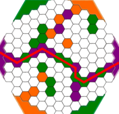
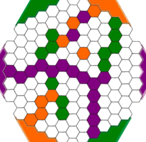
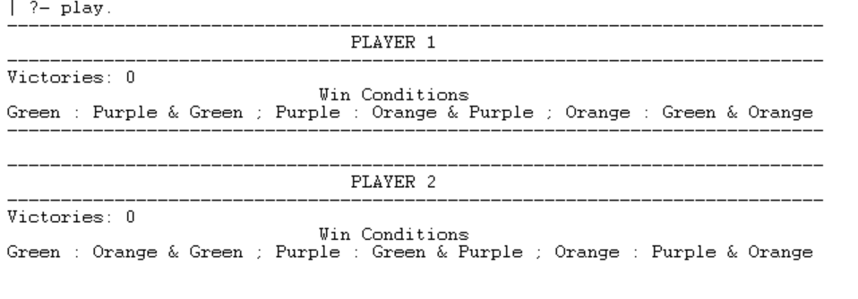
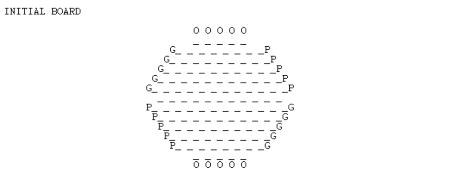
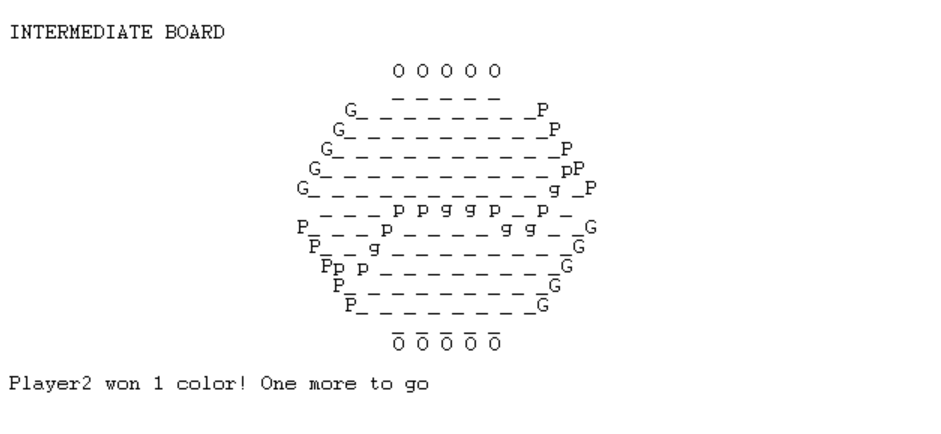
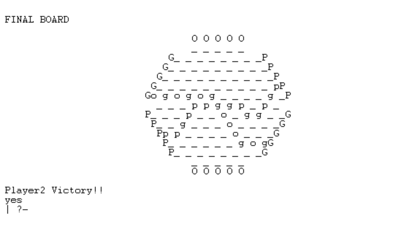

# Trabalho Prático Nº1 - Alliances

## Identificação

**Grupo T6_Alliances2**

- Beatriz Costa Silva Mendes - up201806551@fe.up.pt
- Hugo Miguel Monteiro Guimarães - up201806490@fe.up.pt

## Instalção e Execução

Todos os passos necessários para correta execução do jogo em ambientes Linux e Windows (para além da instalação do SICStus Prolog 4.6).

TODO

## O Jogo - Alliances

### Componentes

- 1 tabuleiro
- 42 discos verdes
- 42 discos laranja
- 42 discos roxos
- 2 discos de prata

### Regras

Cada jogador tem as suas ***allied colours***. Estas são usadas para conectar os dois lados do tabuleiro e diferem entre jogadores. Posteriormente está uma tabela com a distinção das *allied colours* para cada jogador.

|Para conectar   |Laranja  |Roxo   |Verde   |
|---|---|---|---|
|**Jogador 1**   |Laranja + Roxo   |Roxo + Verde   |Verde + Laranja   |
|**Jogador 2**   |Laranja + Verde   |Roxo + Laranja   |Verde + Roxo   |

### Gameplay

- Em cada turno, um jogador necessita de colocar um disco de uma cor à sua escolha num espaço vazio.
- Se uma conexão é feita entre lados opostos da mesma cor, utilizando os discos das cores aliadas, esse jogador ganha essa cor.
- Cada cor pode apenas ser ganha por 1 jogador.
- O jogo termina quando um dos jogadores ganha a sua segunda cor, sendo atribuida a vitória a esse mesmo jogador.
- Se uma jogada bloquear qualquer jogada subsequente que permita um jogador ganhar uma cor, o oponente do jogador bloqueado ganha essa cor.
- No caso de um jogada formar uma conexão para ambos os jogadores, a cor e atribuida ao jogador que colocou o disco.



*Exemplo 1: Jogador 2 venceu ao unir a cor roxa usando peças verdes e roxas*



*Exemplo 2: Jogador 2 venceu ao impedir usando uma barreira roxa o jogador 1 de conectar a cor laranja.*

## Lógica do Jogo
Descrever (​não basta copiar o código fonte​) o projeto e implementação da lógica do jogo em Prolog. ​O predicado de início de jogo deve ser ​````play/0````​. (até 2000 palavras no total)
### Representação interna do estado de jogo

ATUALIZAR

- Tabuleiro - É representado através de uma lista de listas de uma malha hexagonal, contendo os seguintes átomos:
    - '_' - `position`: Representa uma posição que ainda não está ocupada.
    - ' ' - `empty`: Representa um espaço vazio não jogável (apenas para formatação da malha hexagonal).
    - 'g' - `green`: Representa uma posição preenchida pela cor verde.
    - 'p' - `purple`: Representa uma posição preenchida pela cor roxa.
    - 'o' - `orange`: Representa uma posição preenchida pela cor laranja.
    - 'G' - `gWall`: Indica um dos extremos de conexão da cor verde.
    - 'P' - `pWall`: Indica um dos extremos de conexão da cor roxa.
    - 'O' - `oWall`: Indica um dos extremos de conexão da cor laranja.
- Jogador - É representado através dos átomos `player1` e `player2`, sendo o próximo jogador a jogar imprimido no ecrã.

### Visualização do estado de jogo

ATUALIZAR

O estado de jogo é visualizado através do predicado recursivo
- `display_game([Head|Tail],Player)`
    - `[Head|Tail]` - Corresponde a uma lista contendo o estado de jogo.
    - `Player` - Corresponde a um átomo que permita indicar qual o jogador que irá efetuar a próxima jogada.

O predicado imprime recursivamente o estado de jogo e, no fim, imprime qual o jogador que irá efetuar a próxima jogada. 
Em cima do tabuleiro estará um *header* correspondente ao *Player1* que apresenta o número de cores que conseguiu ao longo do jogo e as suas *win conditions*. Um *header* semelhante também será apresentado para o *Player2*.

##### Player Header 


##### Estado inicial de jogo :


##### Estado intermédio de jogo :


##### Estado final de jogo :


### Lista de Jogadas Válidas

Obtenção de lista com jogadas possíveis.

TODO

````pl
valid_moves(+GameState, +Player, -ListOfMoves)
````

### Execução de Jogadas

Validação e execução de uma jogada, obtendo o novo estado do jogo

TODO

````pl
move(+GameState,+Move,-NewGameState)​
````

### Final do Jogo

Verificação do fim do jogo, com identificação do vencedor

TODO

````pl
game_over(+GameState, -Winner)
````

### Avaliação do Tabuleiro

Forma(s) de avaliação do estado do jogo.

TODO

````pl
​value(+GameState, +Player, -Value)
````

### Jogada do Computador

Escolha da jogada a efetuar pelo computador, dependendo do nível de dificuldade

TODO

````pl
choose_move(+GameState, +Player, +Level, -Move)
````

## Conclusões

Conclusões do trabalho, incluindo limitações do trabalho desenvolvido (*​knownissues*​), assim como possíveis melhorias identificadas (​*roadmap​*) (250 palavras)

## Bibliografia
[Alliances Abstract Strategy Board game - How to Setup Playthrough and Review * Amass Games *](https://www.youtube.com/watch?v=VNyHiCfOWhw)

[nestorgames - Alliances](https://nestorgames.com/#alliances_detail)
